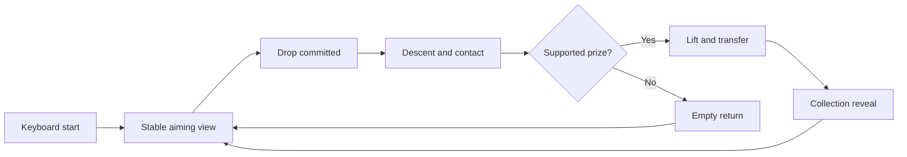

# Little Cloud Arcade - Plan

## Goal Capsule

Create a keyboard-playable miniature claw arcade whose objects, lighting and animation make people want to reach through the screen and pick up a toy.

The user approved the crafted miniature arcade direction and delegated visual choices, including redesigning the cabinet and adding prize families and colour variations. This is a substantial visual reimagining of Cloud Claw. The user requested a new GPT-6 Astra task with higher reasoning effort; Ultra was proposed in the conversation. No further art-direction approval is needed before the first playable iteration. No unresolved product blockers remain.

## Product Contract

### Creative brief

Build **Little Cloud Arcade**, a small collectible world presented with the care of an animated feature's miniature set. Make the machine an object someone would want on their desk. Make its inhabitants toys someone would choose individually. The emotional sequence is curiosity, anticipation, contact, suspense, delight.

Use a warm ivory cabinet with cherry-red enamel accents, muted seafoam interior, champagne metal details and restrained illuminated lettering. Set it in a compact arcade nook on a crafted plinth, with a few supporting objects that communicate scale: a tiny stool, a token dish, a prize display shelf and a warm lamp. Compose these as a scene, leaving the play chamber visually dominant. The reference cottages suggest coherent world-building; their actual buildings need not be copied into the arcade.

Let the cabinet demonstrate mechanical care: softened corners, layered panels, small fasteners, hinges, rubber seals, a believable carriage and cable, articulated fingers, and a generous prize chute. Keep glass legible through edges and reflections without obscuring the claw. Use lighting to describe surfaces and separate silhouettes. A bright rim on a translucent toy can be spectacular precisely because the nearby plush stays soft and matte.

Populate the chamber with a curated cast:

- A floppy-eared bunny in cream, dusty rose and lavender. Embroidered face, visible seams, slightly lagging ears.
- A round capybara in caramel and cocoa. Low centre of mass, small paws, sleepy expression, restrained body compression.
- A cloud cushion in ivory and pale blue. Piped seam, pillowy lobes, small stitched expression, soft recovery after contact.
- An original jelly star in translucent lime, peach or blueberry. Readable thickness and internal colour, expressive face, a wobble that travels and decays after release.
- A small retro vinyl robot in seafoam and butter yellow. Satin body, separate joints and face panel, a firmer response that contrasts with the soft toys.

Show roughly 10–12 prizes across these five families. Art-direct the mix rather than assigning independent random colours. Vary orientation, scale within a narrow range, expression and one small accessory where useful. Every family must have an appealing silhouette at gameplay distance. Recolouring the same two meshes is insufficient.

Give the world life through small event-driven performances. A toy notices the claw approaching; a bunny's ears trail a lift; a jelly star settles after landing; two nearby toys briefly react to a catch. Quiet moments matter. Avoid synchronized bouncing across the entire chamber.

Make a successful grab a complete performance. The carriage eases to rest, fingers open, the claw descends, individual fingers visibly contact the toy, the toy yields according to its material, the cable takes the load, the prize clears its neighbours, and the machine carries it to the chute. Finish with a close-up on the collection shelf, a small celebratory expression and a concise invitation to play again. One restrained cinematic view change after commitment may enhance the reveal. Never interrupt aiming with a moving viewpoint.

### Requirements

**Visual world**

- R1. Deliver the crafted miniature arcade described above, with the cabinet and prizes occupying the dominant visual area.
- R2. Include all five prize families and a curated assortment with visible differences in silhouette, surface and behaviour.
- R3. Make fabric, enamel, metal, glass, jelly and vinyl visually distinct under one coherent lighting setup.
- R4. Keep the claw, target area and contact points readable throughout the round, including through cabinet glass.

**Interaction and animation**

- R5. Make the full play loop available using keyboard: Enter to begin/replay, arrows or WASD to aim, Shift for fine aiming, Space to drop, R to reset, and H to hide/show presentation UI.
- R6. Do not request, access or test a physical camera, microphone or hand tracking; present keyboard play immediately and omit camera onboarding from this iteration.
- R7. Keep the virtual viewpoint stable during aiming; any cinematic motion must start after drop commitment and respect reduced-motion settings.
- R8. Animate the complete grab sequence with visible contact, material-specific response, supported lifting, transfer and delivery.
- R9. Make catches depend on aiming and support; an empty drop must visibly reach the bed and return empty, with no teleporting or forced win.
- R10. After success, display the captured toy on a small collection shelf until reset; replay must remain available without a reload.
- R11. Prevent repeated drop commands from starting overlapping sequences and allow reset to recover from every phase.
- R12. Keep sound absent or disabled throughout this visual iteration.

**Presentation and delivery**

- R13. Keep the visible interface compact and integrated with the toy world, with readable controls and a quiet CoderPush maker mark.
- R14. Show an honest loading state and a useful error if assets cannot load; never leave the user staring at an indefinite spinner.
- R15. Deliver a locally runnable browser experience with a verified preview, hero screenshot, material close-ups and a short recording of an actual keyboard-played round when capture tooling permits.

### Key decisions

- Crafted miniature arcade was selected over a luxurious realistic arcade or surreal machine world (session-settled: user-directed — the user agreed to the recommended miniature world after being offered the alternatives).
- Preserve CoderPush as a discreet maker mark. Treat AWS booth copy and physical-prize matching as deferred event configuration. The new assortment is a virtual art prototype, not a promise of available real prizes.
- Keep the existing working game as a starting point, but give Astra freedom to replace models, lighting, scene dressing, layout and animation where the new result is better. Avoid limiting this to numeric material tweaks.
- Prioritize a coherent, playable scene over a feature checklist. Simplify background dressing first if performance suffers; retain the distinct prize families and convincing contact.
- The camera restriction in R6 refers to physical cameras/webcams. The virtual 3D viewpoint is governed by R7.

### Key flow

F1. Start, aim, commit, catch, reveal, replay. The player uses R5; the presentation follows R7–R10. An empty or unsupported grab returns empty. Reset is available throughout per R11.

### Acceptance examples and quality bar

- AE1. Covers R2–R4: In a paused hero frame, the five families are distinguishable, plush looks soft, jelly looks translucent, and glass does not hide the claw.
- AE2. Covers R5–R6: On a fresh browser session, the player begins and completes a round entirely by keyboard with zero media-device prompts or access.
- AE3. Covers R7–R10: A supported catch produces visible contact and continuous motion to the collection shelf. An empty drop does not become a win.
- AE4. Covers R11: Repeated Space presses during descent create one round; pressing R during lift resets all involved objects coherently.
- AE5. Covers R7 and R12: Reduced-motion mode preserves clear gameplay while suppressing decorative motion and cinematic viewpoint changes; the experience remains silent.
- AE6. Covers R15: Record the actual measured browser performance, viewport and device for a full round. Target approximately 60 fps on the development laptop at 1440×900; report failures honestly and adapt decorative rendering before declaring success.

Review the hero frame, grip close-up, lift and reveal against the supplied references. A passing build alone is not the visual acceptance signal. Judge whether shapes feel designed, contact feels physical, motion has weight and the composition still reads at a glance. No literal 100× measurement is claimed.

### Scope boundaries

Camera/gesture work, sound design, multiplayer, browser fingerprinting, real prize inventory, lead capture, deployment and CoderPush website changes are outside this iteration. The landing-page project can reuse the art-direction lessons in a separate task.

### Reference observations and source investigation

The six supplied X posts were opened and their visible media inspected. Moving states were sampled for the jelly and train demos; this is not a full frame-by-frame analysis of every clip. Author claims about generation time are not verified benchmarks.

- https://x.com/scottstts/status/2096008241104711698 — Soft Matter: coloured translucent jelly with deforming form and strong reflections. Borrow the coupling of material and motion, not uniform gloss.
- https://x.com/tomkrcha/status/2096082580554777041 — Steam Atlas: detailed locomotives and exploded assembly. The author says geometry and animation are code-generated. Borrow layered mechanical construction and precision; do not add an exploded-view feature to this scope.
- https://x.com/scottstts/status/2096364764054131119 — Jelly Baby: expressive translucent character, warm wood and directional light. Borrow restrained character performance and material contrast.
- https://x.com/Frs0n_/status/2096564365092958244 — multiplayer Jelly Baby variation with differently coloured characters. Borrow assortment/personality; networking and fingerprinting are not needed.
- https://x.com/369Serena/status/2096101870007734643 — pastel Dream Cottage diorama, coordinated controls and palette. Borrow scene coherence and presentation hierarchy.
- https://x.com/xikhar/status/2095969538290712800 — Blender miniature cottage scene with layered structures, trees, bridge and small props. Borrow authored shapes and coherent scale.
- https://x.com/mech_eng_dev/status/2096019217698967809 and https://x.com/mech_eng_dev/status/2096019920974725280 — previously inspected Dumpling Club clip and full prompt. Borrow one complete, charming action with a clear payoff and explicit art direction.

Jelly-Baby source inspected at commit `78808219812e5be4e7913937ead83a6c296c5efe` from https://github.com/scottstts/Jelly-Baby . `src/physics/soft-body.js` implements elastic deformation; `src/graphics/baby.ts` couples the deforming surface to a transmissive material; `jelly-flavors.ts` changes absorption as well as colour; `face-expression.ts` reacts to being held/released and schedules blinks. `renderer.ts` requires WebGPU and disables its WebGL fallback. These are source observations, not performance validation. The live site remained at its loading screen during this inspection; no successful live playtest is claimed.

No license file was found in this checkout. Study the mechanisms and author original code/assets unless reuse permission is verified. A WebGPU migration or a full soft-body solver is not a requirement: choose the implementation that delivers the observed material response reliably within the existing game's rendering budget.

## Implementation record — 7 September 2026

Implemented directly with Astra in the isolated `8cfd/claw3d` worktree. No subagents, external review, deployment or PR. The original booth modules and assets remain available; the active entry now uses the independent Little Cloud modules.

Completed implementation sequence:

1. Author an enamel cabinet, a miniature plinth and scene dressing, and eleven original toys across the five required families.
2. Add keyboard-only state transitions, independent support contacts, material response, articulated fingers, a full-size prize outlet, a hinged bed cover and a supported courier to the collection gallery.
3. Inspect rendered hero, grip, lift and reveal frames. Correct overexposure, the backdrop horizon, claw-to-ear clearance, shelf heights, outlet clearance, floating toys and replay carriage continuity.
4. Validate the active media-free import graph, the existing tests and new state/contact tests, then exercise actual keyboard gameplay in Chrome.

### Implementation choices

- The active scene generates all geometry and textures locally with Three.js. No Jelly-Baby code/assets, third-party character models or downloaded typefaces are incorporated.
- Three fingers close independently against scaled, rotated support envelopes. A catch also requires its centre of mass to fall within the supports. No target recentering, random success or forced award.
- Curated spacing and guided movement provide a readable arcade grasp. This is not a general rigid-body or soft-body simulation; small collision envelopes and stylized deformation are deliberate approximations.
- A hinged cover makes the collection chute part of the bed during aiming and empty drops. The opening and collection slots accommodate the original-size toys. A visible courier platform carries the prize to its assigned shelf.
- Plush compresses, bunny ears trail, jelly has a decaying surface wave, and vinyl responds more firmly during contact/lift. Decorative performance and the collection viewpoint respect reduced motion.
- Collection persists for the browser session until R or reload. No persistence service, real inventory, sound or media-device access is implemented.

### Verification record

- `npm test`: 53 tests pass, including 11 Little Cloud tests and 42 retained baseline tests. Baseline gesture tests exercise pure logic; they do not access any media device.
- `npm run build`: passes. The main Three.js/application chunk is approximately 603 kB (160 kB gzip), with Vite's standard size advisory.
- Chrome keyboard checks completed: supported catch, repeated Space, a bed-reaching empty drop, replay retention, R during every animation phase, H, all eleven catches and a full gallery, and a fixed viewpoint during reduced-motion play.
- Initial full-round measurement: Chrome at 1440 × 900, device scale 1, Apple M4 Pro; approximately 120 fps, 9.4 ms p95 frame time, zero frames above 33.4 ms. The final browser report and production-preview measurement are recorded with the screenshots.
- Browser outputs are kept in locally ignored `.screenshots/`: hero, contact/lift/delivery/reveal, material close-ups, full collection, failure states and a real keyboard-played video. `tests/arcade.browser.mjs` reproduces the checks.

Final verification completed:

- Stable production preview: **http://127.0.0.1:4197/**. The actual built page completed a keyboard-played Otto catch and reset. Development inspection and diagnostics are absent in production.
- Final production measurement: **120 fps average**, **9.0 ms p95**, **0 frames above 33.4 ms**, over **1,518 frames** of the full round. Chrome **152.0.7977.76**, Apple **M4 Pro / Mac16,8**, viewport **1440 × 900**, device scale **2**, effective render buffer **2160 × 1350** (renderer ratio capped at 1.5). Results describe this laptop/browser, not unmeasured devices.
- The complete browser suite passed. It captured all eleven toys using actual keyboard events, retained the full gallery, and passed the entry-download failure and renderer-failure checks. Media-device/audio-call audit, tracking-model request audit and unexpected browser errors are all **zero**.
- Hero: `.screenshots/production-hero.png`; five material close-ups: `.screenshots/material-{butter,peach,miso,pip,blue-hour}.png`; complete gallery: `.screenshots/complete-collection.png`.
- Actual keyboard gameplay: `.screenshots/keyboard-gameplay.mp4` and `.webm`, **16.48 seconds**, **1440 × 900**, silent. The recording is captured at 25 fps; it is independent of the renderer frame-rate measurement.
- Machine-readable browser evidence: `.screenshots/verification.json` and `.screenshots/production-verification.json`. Full logs: `.screenshots/browser-checks.txt` and `.screenshots/unit-tests.txt`.
- Final material refinement keeps the vinyl robot's landing compression below the plush and jelly response. The built production robot catch was verified after that adjustment.

Remaining limits: guided grasp/transport and stylized deformation, session-only collection, keyboard input only, silent play, and desktop Chrome performance coverage. No physical camera/microphone, gesture tests, deployment or CoderPush web-repository work was performed.
