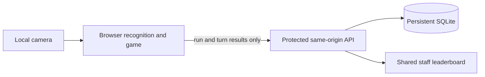

> Historical plan, superseded by the current [PRODUCT.md](../PRODUCT.md). It records the original implementation scope, not current player instructions or new deployment authorization. Practice/warm-up policy is retired; current physical acceptance remains open.

# Clear camera controls and shared staff playtest

## Goal Capsule

**Objective:** First-time staff can play three turns without coaching and compare their scores across laptops.

**Means:** Improve the existing camera feedback and gesture lifecycle first; then serve the existing game with a small shared leaderboard over protected HTTPS.

**Authority:** This document answers the September 7 planning request. The user accepts whichever hosting route is easier first. HTTPS and Railway below are recommended implementation choices, not an existing deployment or authorization to provision one.

**Execution boundary:** The next coding task implements U1–U3 only. Complete physical camera validation before U4–U6. Keep the same checkout and active implementation. No scene rewrite, keyboard gameplay, new physics, or scoring redesign.

**Stop conditions:** Camera milestone ends at reproducible automated checks and an honestly reported physical playtest result. Shared pilot ends only after two real laptops demonstrate shared, persistent scores. Missing hosting access blocks deployment, not local implementation.

**Execution profile:** A fresh, focused coding task is recommended. High reasoning effort is useful for gesture timing and ownership diagnosis. Do not launch it from this planning task without the user's request.

## Product Contract

### Problem and current evidence

At inspected build `eff626a`, preview listens on `127.0.0.1:4197`; staff cannot use that address from their laptops. Scores use browser local storage in `src/event-session.js`; changing the server bind address would not make them shared.

The live camera and skeleton already exist in `index.html`, but the small panel does not clearly communicate control ownership, recognized gesture, and required next action. `src/vision.js` accepts results using arrival freshness; delayed frames can affect controls. Its clasp detector requires two separately visible hands, so literal touching palms may occlude recognition. This is a code-grounded hypothesis requiring physical testing. The moving-star cue does not account for the clasp confirmation delay.

### Camera requirements

- **R1:** Keep camera-only steering and deliberate two-hand drop, dark arcade styling, CoderPush/AWS branding, spacious scene, and brief instructions. Names and operator forms remain ordinary forms.
- **R2:** Show a readable mirrored camera panel, the controlling hand, recognized state, next action, and hold progress. Display recognition independently from whether gameplay currently accepts input.
- **R3:** Reject stale frames, recover from hand loss, and accept each deliberate drop once. A committed drop finishes even after tracking disappears. Only explicit host pause can pause delivery.
- **R4:** Before a scored run, teach steering and drop through an unscored rehearsal. Three scored turns remain intact. Align the moving-star timing cue with the actual confirmation and descent delay.

### Shared pilot requirements

- **R5:** Staff enter a display name and play independent runs on a common board. Preserve existing 100/200 prize values and three turns. Allow repeat runs during the staff pilot; retain the existing all-completed-runs ranking and tied ranks. Names are not verified identities.
- **R6:** Store boards, rule snapshots, runs and turns centrally. Retry safely, survive restart, and show a score as saved only after acknowledgement. Keep existing local scores private unless deliberately exported/imported later.
- **R7:** Serve through trusted HTTPS with staff access protection and separate host authorization. Camera frames and landmarks stay in the player's browser. Share only names and game results with the server.

### Player flow

Name → camera permission → show one hand → steer to a practice marker → bring two visible hands together with a small gap → fill hold ring → three scored turns → saved score and rank.

Keep the corner panel around 240–280 px wide on desktop, sized to fit without covering the game, banner or controls. Expand its guidance during setup and tracking recovery; reduce its visual emphasis during delivery. Use labels as well as color:

| State | Visible feedback | Instruction |
| --- | --- | --- |
| Acquiring | Live hand outline and central acquisition guide | Show one hand |
| Steering | Controlling hand highlighted; direction arrow and neutral marker | Move your hand |
| Arming drop | Both hands outlined; separate illustrative pose guide | Hands apart, then together |
| Confirming | Hold ring driven by actual recognition | Keep a small gap |
| Accepted | Locked confirmation, then claw animation | Here it comes |
| Lost | Tracking state and recovery guide | Bring one hand back |

The illustrative guide must look different from detected landmarks. Do not invent recognition-confidence percentages. Permission denied, no camera, model loading/error, and interrupted device each need a brief explanation and a retry path without spending a turn. Normal form controls remain keyboard accessible; no keyboard gameplay fallback. Text and shapes carry state without color dependence. Honor reduced-motion settings for decorative feedback.

Rehearsal confirms movement and one valid clasp without starting a scored run. Keep it short; returning players may skip the explanation after successful rehearsal for the same control version, but still acquire control before aiming. Failed setup never consumes a turn. Provide exit/retry rather than an endless tutorial.

### Assumptions and exclusions

Pilot target: 5–10 simultaneous staff on camera-equipped laptops using Chrome/Edge, with internet access. Handheld phone play is excluded: holding a phone conflicts with a two-hand gesture. The HTTPS link works in the office but is not restricted to the LAN.

No badges, facial identification, replay enforcement, queue system, analytics dashboard, new environments, full toppling physics, or prize-grade anti-cheat. Shared storage moves into near-term scope because the user explicitly requested staff comparison. Camera usability remains first.

## Planning Contract

### Decisions and boundaries

1. Extend `src/vision.js`, `src/clasp.js`, and `src/camera-controls.js`. Keep recognition telemetry separate from game-action permission. Do not introduce a second gesture engine.
2. Preserve the clasp first and make its real requirements visible. If five-player testing still fails, stop and propose one controlled camera-gesture experiment instead of silently adding modes.
3. Prefer a single Node service serving the built frontend and same-origin JSON API, with SQLite on a persistent Railway volume. Railway supplies HTTPS. This is a small pilot deployment; one instance, no distributed database or WebSockets needed. Verify a maintained SQLite driver against the selected Node runtime during U4.
4. Use protected polling roughly every two seconds and refresh after saving a run. Staff access uses a shared pilot code exchanged for a secure HTTP-only same-site session cookie; host access uses a separate server-verified secret/role. Neither secret belongs in the frontend bundle. Existing visible operator controls are not authorization.
5. Server issues run IDs and computes totals from accepted prize IDs and the run's rule snapshot. Client-reported catches remain trusted for this pilot: server-side totals do not prove the catch happened. Do not advertise verified competition fairness.

### Sources and verification limits

- Active implementation: `index.html`, `src/arcade.js`, `src/arcade.css`, `src/vision.js`, `src/clasp.js`, `src/camera-controls.js`, `src/arcade-mechanics.js`, `src/event-session.js`.
- Product baseline: `docs/PRODUCT.md`; workflow: `AGENTS.md`; runtime scripts: `package.json`.
- [MDN camera requirements](https://developer.mozilla.org/en-US/docs/Web/API/MediaDevices/getUserMedia): ordinary LAN HTTP does not satisfy the secure-context requirement; localhost is a special case.
- [Railway HTTPS](https://docs.railway.com/networking/public-networking) and [persistent volumes](https://docs.railway.com/volumes): support the proposed deployment shape. Account/project access and cost have not been checked.
- Automated camera fixtures cannot prove physical gesture usability. No new physical-camera result is claimed by this plan.

## Implementation Units

### U1 — Trustworthy recognition and recovery

**Requirements:** R2, R3. **Dependencies:** none.

**Files:** `src/vision.js`, `src/clasp.js`, `src/camera-controls.js`, `tests/camera-fixture.mjs`, `tests/camera.browser.mjs`, `tests/clasp.test.mjs`.

**Approach:** Emit consistent telemetry for acquisition, ownership, steering, clasp progress, loss and blocked action. Reject out-of-order or over-age captures before they update ownership, hold progress or freshness. Begin with a 300 ms capture-age budget and measure on target hardware. Invalidate callbacks across camera stop/restart. Expose developer-only capture age and rejection reason. After a brief loss grace, release ownership and require stable one-hand reacquisition; never snap to a bystander. Keep recognition running during delivery without enabling actions. Remove stale keyboard-fallback copy.

**Tests/verification:** Delayed results cannot steer/drop; stop/restart cannot revive old results; missing hands never advance the hold; a prolonged loss reacquires cleanly; a drop fires once and delivery continues after loss. Run targeted camera/clasp tests, then the project checks at the U3 checkpoint.

### U2 — Visible control and unscored rehearsal

**Requirements:** R1, R2, R4. **Dependencies:** U1.

**Files:** `index.html`, `src/arcade.css`, `src/arcade.js`, `src/camera-controls.js`, `tests/camera.browser.mjs`, `tests/arcade.browser.mjs`.

**Approach:** Promote the existing preview into the corner panel described above. Use actual controlling-hand identity for highlighting, including during clasp. Add the rehearsal before official run creation and timer start. Preserve one short instruction per state. Show a separate illustrative hand pose only when useful. Keep camera permission separate from scoring. Verify crop and mirror alignment for 4:3 and 16:9 inputs instead of assuming the current overlay is misaligned.

**Tests/verification:** Rehearsal adds no score/turn/run; denied permission and retry are usable; panel remains legible at laptop widths and does not cover the claw banner; landmark coordinates match the mirrored image. Save locally ignored screenshots and inspect the actual preview.

### U3 — Predictable drop timing and camera playtest

**Requirements:** R3, R4. **Dependencies:** U1, U2.

**Files:** `src/arcade-mechanics.js`, `src/arcade.js`, `src/clasp.js`, `tests/carousel.test.mjs`, `tests/carousel.browser.mjs`, `tests/camera.browser.mjs`, `docs/PRODUCT.md`.

**Approach:** Distinguish when to begin holding from when drop is accepted. Account for measured confirmation plus descent timing in the star cue; preserve moving targets and skill-based outcomes. Do not tune scoring at the same time. Record any competitive control/rule version change on a new pilot board.

**Tests/verification:** Cue predicts contact across the motion cycle; accepted drop continues when hands leave; exactly three results. Run `npm run check` and `npm run check:booth` sequentially, rebuild the preview, verify BUILD, then conduct the physical acceptance session below. Commit the focused camera deliverable with remaining physical limitations explicit.

### U4 — Minimal shared run service

**Requirements:** R5–R7. **Dependencies:** U3 physical acceptance.

**Files:** new `server/index.js`, `server/store.js`, `tests/server.test.mjs`; `package.json`, lockfile, `src/event-session.js` as needed for reusable pure rules.

**Approach:** Add staff login/logout, current board, start run, submit turn, and leaderboard endpoints; host-only board creation/export controls. Each browser session owns independent runs; never copy the browser store's single global active-run assumption into the server. Validate nonempty names up to 24 characters and render as text. Never use names as identity keys.

Use transactions and a unique `(runId, turnIndex)` constraint. Accept explicit miss/timeout outcomes worth zero as well as known prize IDs. Identical retries return the existing acknowledgement; conflicting retries and out-of-order turns fail explicitly. Three acknowledged turns complete the run atomically. Bind each run to its original board/rules; rotating boards stops new starts on the old board but lets existing runs finish there. Keep previous boards archived.

Use a separate opaque, server-issued browser-owner cookie whose lifetime covers the pilot; reauthenticating staff access preserves this owner. Never reconstruct ownership from a name. If that cookie is deleted, explain that pending scores cannot be reclaimed automatically. On reload, replay pending completed turns; mark an interrupted, unrecorded run abandoned rather than inventing a catch or restoring an unpersisted physics scene. Completed turn submissions remain retryable for the original owner.

Authenticate all data routes; authorize run ownership and host mutations server-side. Check same-origin writes, bound payloads, rate-limit login attempts, and omit names/secrets from routine logs. Store secrets only in environment configuration. Keep pilot data until the host removes the pilot; document export and deletion, including backups.

**Tests/verification:** Two sessions play concurrently; one cannot write another's run; duplicates/conflicts/out-of-order submissions; invalid names/prizes; unauthorized export/reset; totals and ties; board rotation mid-run; restart persistence. No automatic import of old local scores.

### U5 — Shared names, results and honest save states

**Requirements:** R5, R6. **Dependencies:** U4.

**Files:** new `src/session-api.js`; `src/arcade.js`, `index.html`, `src/arcade.css`, `tests/arcade.browser.mjs`, new `tests/shared-session.browser.mjs`.

**Approach:** Connect registration and scoring to the service without moving physics to the server. Require an acknowledged server run before ranked aiming begins. Persist pending submissions locally with the issued run ID, replay them in order, and clear them only after acknowledgement. Show “Score waiting to sync” until confirmed; never invent a saved rank. Resume pending saves after reload; if the session has expired, reauthenticate before retrying without assigning the result to a new player. A new browser cannot take over a run by guessing its ID.

Keep standalone local development explicitly local; do not silently fall back to a browser-only leaderboard on network errors. Allow an explicit unranked practice path when a ranked start is unavailable. Results show the final score, three-turn breakdown and actual rank; no additional bonus systems.

**Tests/verification:** Separate browser contexts see the same board; network loss after server commit but before acknowledgement creates one result; refresh/reauthentication recovers pending scores; empty board and unavailable service have clear states; repeat names remain distinct runs.

### U6 — Protected HTTPS pilot and handoff

**Requirements:** R6, R7. **Dependencies:** U5; deployment authorization and project access.

**Files:** deployment configuration as required; `README.md`, `package.json`, `server/index.js` and `docs/PRODUCT.md` for verified operating instructions.

**Approach:** Serve built assets and API from the same origin. Configure one service instance, persistent database directory and staff/host secrets. Fail startup if production persistence is missing. Confirm model assets work behind the access gate. Document export/backup and restore before inviting staff. Keep the previous local preview available as a development fallback, not a shared score source.

**Tests/verification:** Two real laptops open the HTTPS link, permit their own cameras, submit different names/runs and see both results within three seconds of acknowledgement. Restart the service and verify scores remain. Verify unauthorized access is denied. Inspect browser/network logs without recording camera frames. Test restoration from a disposable backup; rollback to the previous build without resetting the database. Report the tested URL and BUILD only after success.

## Verification Contract

Camera acceptance: five first-time players on the target camera/display; at least four acquire control within ten seconds and complete the rehearsal drop within fifteen seconds after acquisition. All five complete three scored turns without coaching, unintended drops, freezes or host recovery. Target 60–90 seconds for the scored run; record setup time separately. Capture build ID and observed hesitation, not video by default.

Ask what each player would try differently next time. Reliability is required, but it does not prove a wow experience. A clear strategy for the next attempt and voluntary replay requests are useful qualitative evidence. If clasp remains unreliable, stop expansion and test one simpler camera gesture as a separate decision.

For shared play, require U4–U6 concurrency, retry, authorization, persistence and real-device checks. Synthetic input proves integration only. Record limitations and failures alongside results; never count unperformed checks as passed.

## Definition of Done

The camera task delivers U1–U3, a verified build, local conventional commit and physical observations or a clearly stated outstanding physical test. Shared-pilot coding is a separate task after that gate. The overall staff milestone requires U4–U6 and a verified protected URL with shared scores. No push, merge or deployment is implied by this planning document.

**Fresh-task handoff:** Implement U1–U3 of this plan in `/Users/qron/code/claw3d`. Read `AGENTS.md` and `docs/PRODUCT.md`, verify branch/worktree/build, and extend the active arcade entry. Focus on clear camera feedback, stale-frame/ownership recovery, unscored rehearsal and deliberate drop timing. Preserve three turns and camera-only gameplay. Run the existing checks sequentially and report physical-camera evidence separately. Do not implement hosting or the shared backend in this task.
