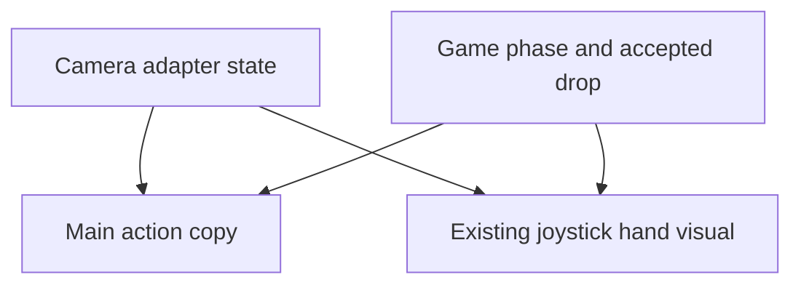

> Historical plan, superseded by the current [PRODUCT.md](../PRODUCT.md). It records the original implementation scope, not current player instructions or new deployment authorization. Practice/warm-up policy is retired; current physical acceptance remains open.

# Clearer Camera Play - Plan
## Goal Capsule

- **Objective:** First-time staff players can see when their hand controls the game and understand the next action without coaching.
- **Means:** Improve the existing arcade in three bounded units (KTD1–KTD3).
- **Authority:** Current user request, `AGENTS.md`, `docs/PRODUCT.md`, then this plan.
- **Execution:** Autonomous implementation with separate ownership; integrate and test browser work sequentially in the agreed checkout.
- **Stop conditions:** Do not change recognition rules, scoring, shared persistence, or deployment scope to obtain a cleaner presentation.
- **Tail ownership:** The integrating agent reviews, verifies, commits and pushes coherent changes; staff own physical usability acceptance.
## Product Contract

### Summary

Simplify proven redundant implementation paths, make camera control visible on the existing joystick, and reduce competing player instructions.
Keep the current booth game and its spacious arcade presentation.

### Problem Frame

The user sees gesture feedback mainly in the small webcam view, while moving the joystick alone does not make control ownership obvious.
Repeated and rigid copy competes for attention before the product reaches staff playtesting.

### Requirements

**Interaction and presentation**

- R1. Preserve the camera-only interaction and three-turn scoring contract in `docs/PRODUCT.md`.
- R2. Show a stylized hand holding the existing joystick when steering is acquired, with distinct lost, clasp-progress and accepted-drop feedback.
- R3. Show one concise next action in the main player HUD; retain camera setup/recovery help where it is useful.
- R4. Preserve CoderPush/AWS branding, the spacious scene, accessible status text, and reduced-motion support.

**Simplicity and verification**

- R5. Remove proven unused paths and unnecessary repeated work without replacing the active game, input adapter or scene.
- R6. Preserve accepted-drop completion after input loss and all existing shared run/score protections.

### Scope Boundaries

This pass excludes new input modes, gesture thresholds, difficulty, physics redesign, scoring rules, backend changes and new deployment infrastructure.
Physical-camera testing remains the acceptance gate described in `docs/PRODUCT.md`.

### Acceptance Examples

- AE1. Covers R2/R3: after stable hand acquisition, a visible hand grips the joystick and the main instruction describes steering; stale/lost tracking releases that visual claim.
- AE2. Covers R1/R2/R6: during a confirmed clasp the feedback shows progress; once the drop is accepted, hands may leave while the delivery completes exactly once.
- AE3. Covers R3/R4: a player needing camera recovery sees one clear recovery instruction, while an active delivery gives no conflicting steering command.
## Planning Contract

### Key Technical Decisions

- KTD1. **Prove removals through references.** Start from `index.html` and its `src/arcade.js` import graph; legacy-looking files can still own helpers used by active camera code.
- KTD2. **Render existing camera state.** Extend `src/arcade-scene.js` and its joystick using state already owned by `src/camera-controls.js`/`src/vision.js`; visuals never decide whether movement or a drop is accepted.
- KTD3. **Consolidate instruction ownership.** Let `src/arcade.js` choose the main action from game phase and camera readiness; use camera-local detail only when it adds information.
### High-Level Technical Design

### Assumptions

The stylized grip is a reversible creative interpretation, not a claim that the camera recognizes a literal gripping pose.
Better visibility and shorter copy should improve comprehension; human recognition, delight and booth performance remain unmeasured.
Exact rendering savings depend on runtime comparison; report measurements without promising an arbitrary FPS gain.
## Implementation Units

### U1. Remove redundant paths and repeated work

- **Goal / Requirements:** A smaller implementation and less repeated rendering work (R5); preserve R1/R6.
- **Dependencies:** None; coordinate any `src/arcade-scene.js` edit with U2.
- **Files:** `src/main.js`, `src/scene.js`, `src/style.css` and related proven legacy-only assets are candidates; `src/arcade-scene.js`, `src/arcade.js`, existing `tests/*.test.mjs` and `tests/*.browser.mjs` remain reference and verification surfaces.
- **Approach / Patterns:** Apply KTD1. Follow existing scene batching and change-signature caching. Keep shared helpers with live importers. Measure the same scene/viewport before and after.
- **Test expectation:** No new tests for deletion-only or presentation-only changes; add a focused regression in the owning existing test file if behavior changes.
- **Verification:** Active entry loads; render statistics or repeated work decrease without lost content or failed applicable checks.

### U2. Make joystick ownership visible

- **Goal / Requirements:** Make acquired control and drop intent visible on the machine (R2/R4/R6).
- **Dependencies:** None; U3 consumes the same state vocabulary.
- **Files:** `src/arcade-scene.js`, `src/arcade-art.js` if needed, `src/camera-controls.js`, `src/arcade.js`, `tests/camera.browser.mjs`.
- **Approach / Patterns:** Apply KTD2 with a small procedural hand near the existing joystick; reuse scene materials and reduced-motion handling. Parent scene transforms to the existing control so the hand follows the stick.
- **Test scenarios:**
  1. Covers AE1: acquired steering visibly grips; lost, stopped and stale input remove the active-control claim.
  2. Covers AE2: partial clasp, accepted drop and subsequent input loss render distinct feedback without changing delivery or adding a drop.
  3. Reduced-motion mode preserves static state distinctions and an unobscured playing field.
- **Verification:** Camera browser regression passes; screenshots show the feedback from the normal play viewpoint and in reduced-motion mode.

### U3. Consolidate player copy

- **Goal / Requirements:** A clear next action without competing repeated instructions (R3/R4), preserving R1/R6.
- **Dependencies:** U2 state vocabulary; root integration owns shared `src/arcade.js` edits.
- **Files:** `index.html`, `src/arcade.js`, `src/arcade.css`, `tests/camera.browser.mjs`, `tests/arcade.browser.mjs`, `tests/shared-session.browser.mjs`.
- **Approach / Patterns:** Apply KTD3. Remove repeated persistent guide/status text, shorten state-dependent copy, and retain explicit shared-start failure/retry meaning and accessible status announcements.
- **Test scenarios:**
  1. Covers AE3: setup, acquisition, loss, practice, aiming, clasp and delivery each expose a coherent main action.
  2. Practice completion and shared-start retry still lead into exactly three scored turns; score-saving errors remain visible.
- **Verification:** Sequential camera/event browser checks pass and normal viewport screenshots show no clipped or duplicate action text.
## Verification Contract

Use targeted tests during editing, `npm run check` before each coherent commit, and `npm run check:booth` for camera/phase/collision integration. Run browser suites sequentially; run `npm run test:shared` when shared player flow/copy is touched.
Compare rendering statistics at the same viewport, phase and quality setting with one WebGL session. Save synthetic screenshots locally under `.screenshots/`; never commit screenshots or camera frames.
After committing, rebuild the preview and verify the operator BUILD matches the tested commit. Synthetic camera fixtures prove integration only; physical acceptance remains outstanding.
## Definition of Done

Each unit is focused, reviewed, verified and integrated; abandoned experiments and proven redundant paths are removed, and unrelated changes remain preserved.
The final handoff gives branch, commit, checks, measured rendering evidence and outstanding physical playtesting. Record reusable behavior decisions in `docs/PRODUCT.md` without claiming human acceptance.
