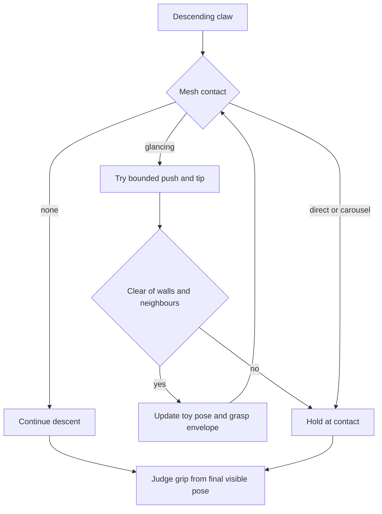

# Toy push contact - Plan

## Goal Capsule

Players see toys yield naturally to an off-centre claw rather than treating every touch as a rigid stop. Implement and verify locally; merge, deployment and physical acceptance are outside this request. Preserve the unrelated camera-control edits in this checkout.

## Product Contract

### Summary and Problem Frame

The current swept mesh contact latches a descent stop and a miss on first contact. Existing rocking never changes the toy's position. The user requested planning and implementation of pushing/tipping contact.

### Requirements

- R1. An off-centre descending finger pushes and tips a free toy away from contact; descent can continue when clearance opens.
- R2. A pinned toy or a direct top contact resists the claw. Toys stay above the bed and inside the cabinet without increasing penetration into neighbours.
- R3. Displaced toys remain in their new pose between turns and can be caught there. A new run restocks them.
- R4. Centred catches, moving-carousel timing, three turns and one score per turn remain intact. Pause and input-loss behavior stay unchanged.
- R5. The change is a local `?contact=push` preview with separate browser scores; shared/public play ignores it pending physical acceptance.

### Key Decision

**Contact-dependent yielding** (session-settled: user-approved — chosen over making every touch topple a toy: placement must still matter). Governs R1 and R2.

## Planning Contract

- KTD1. Extend `ToyContacts` with bounded translation and tilt, using existing mesh sweeps and conservative obstacle bounds. Do not introduce a rigid-body engine. Moving carousel riders retain their existing contact treatment.
- KTD2. Store displaced pose on the game toy and derive a transformed grasp envelope from the same rendered pose. This keeps target selection and subsequent catches aligned with visible toys (R3).
- KTD3. Resolve each descent segment against current geometry; contact holds the claw only while an obstruction remains. Reconcile final descent contact before grip judgement, including frames that cross the phase boundary (R1, R4).
- KTD4. Resolve the preview flag in `resolvePlayMode`; pass it through the existing game creation path and isolate its score namespace (R5).

## Implementation Units

### U1. Contact response and catch geometry

**Goal:** Satisfy R1–R4 in the existing contact, mechanics and scene modules.
**Files:** `src/arcade-contact.js`, `src/arcade-mechanics.js`, `src/arcade-scene.js`, `tests/contact.browser.mjs`, `tests/arcade.test.mjs`.
**Approach:** KTD1–KTD3. Keep legacy contact behavior when the preview is disabled. Reuse the contact browser harness with actual toy geometry.
**Tests:** Free edge hit moves and tips; pinned/top hit holds; no extra bed/wall/neighbour penetration; displaced toy is catchable next turn; new run resets; centred and carousel catches survive; 60/30/10 FPS contact remains bounded; grip-to-lift fingers remain continuous.
**Verification:** Contact/browser regressions pass with actual meshes, alongside mechanics unit tests.

### U2. Local preview integration and product documentation

**Goal:** Satisfy R5 and expose the completed behavior for physical comparison.
**Dependencies:** U1.
**Files:** `src/play-mode.js`, `src/arcade.js`, `tests/play-mode.test.mjs`, `tests/contact.browser.mjs`, `docs/PRODUCT.md`.
**Approach:** KTD4. Add only the contact wiring to the already modified entry file; preserve all pre-existing edits.
**Tests:** Flag off preserves defaults; flag on selects pushing and separate storage; shared/public modes reject it; active scene uses the selected setting.
**Verification:** Unit/build gate plus contact, arcade and carousel browser suites, run sequentially.

## Verification Contract

Run `npm run check` and the affected contact, arcade and carousel suites using `scripts/check-browser.mjs`. Save a local screenshot under ignored `.screenshots/`. Review the focused diff. Physical feel and recognition remain unverified until a person tries the exact build on the intended camera/display.

## Definition of Done

The local opt-in implementation meets R1–R5, regression checks pass, the owning product document describes its limits, and unrelated changes remain intact. Remove abandoned implementation attempts. Do not claim deployment or physical acceptance.
