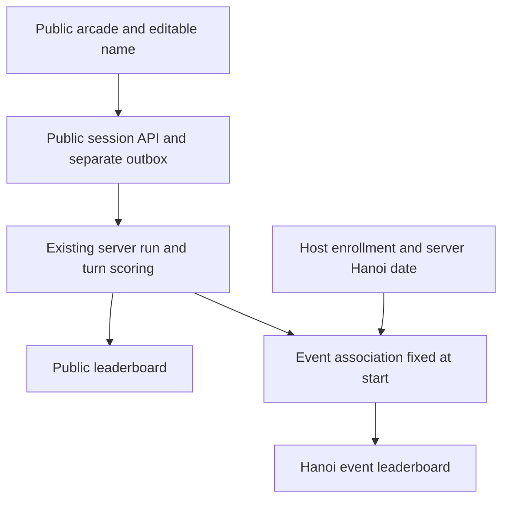
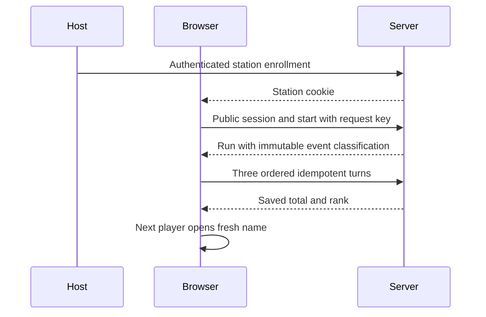

# Public ranked play - Plan

## Goal Capsule

Make Cloud Claw easy for public visitors and the September 29 Hanoi booth to play and compare scores. Implement and verify locally; do not merge, deploy, enroll a production station, or alter historical results without delivery authority. Preserve existing camera work in this checkout.

## Product Contract

### Summary

Rank every completed public run, allow a generated or typed display name, and foreground Next player. Identify event plays from one enrolled browser and the server's Hanoi date.

### Problem Frame

Public Try currently discards results and skips editable names. The event entry requires tickets and recovery steps even when the host supervises the only booth computer. The camera notice resembles a video-call disclosure despite local frame processing.

### Requirements

**Public play**
- R1. Every completed public three-turn run earns its own server-confirmed rank; equal names and repeat plays remain separate results.
- R2. Offer an editable generated name before START; empty names generate a default and names are display labels only.
- R3. Next player is first, visually primary and focused on completion; it opens a fresh generated name while Play again remains secondary.
- R4. Keep three turns, server-side score calculation, idempotent retries and retained pending results.

**Event and privacy**
- R5. Event qualification requires a host-enrolled browser and a run started on 2026-09-29 in Asia/Ho_Chi_Minh. Players need no ticket or login. All such runs also rank on the public board.
- R6. Provide a public privacy page at /privacy and a visible link before camera use, explaining local frames, public names/results and bounded diagnostics accurately.
- R7. Keep the camera preview unchanged. Background segmentation is deferred pending hardware performance evidence.

### Scope Boundaries

No prize eligibility, verified identity, historical imports, live-data resets, hand-tracking changes or deployment. Retain legacy ticket routes for pending attempt recovery, but remove their promotion from normal public play. Historical practice was not saved and cannot be ranked retroactively.

## Planning Contract

### Key Technical Decisions

- KTD1. Reuse the shared run/turn domain and durable session client with a separate public API prefix, owner capability cookie and storage namespace. This keeps R1/R4 score semantics without granting staff authority.
- KTD2. Use a dedicated public board and a run-to-event association. Public reads return bounded name/score/rank projections; personal results retain exact rank beyond the visible top results. Staff boards and ticket records stay separate.
- KTD3. A host-only enrollment action sets a separate HttpOnly station cookie. Event classification is fixed at run creation from server time and that capability, never a query parameter, client date, name or IP address. Request retries retain the original classification.
- KTD4. Keep the public-entry switch, with ranked play enabled by default when public entry is enabled. An explicit ranked-play disable preserves the prior practice route for compatibility and isolated tests; retained public score submissions can drain when new starts are disabled.

### High-Level Technical Design

### Assumptions and Risks

Rank means one completed run, including repeat plays, not one person. Scores remain for fun because catches are client-reported. Enrollment recognizes a browser profile rather than proving physical location; the host's supervision supplies that assurance. Browser clearing requires enrollment again. Runs starting before midnight keep their original classification while finishing after midnight. Existing local uncommitted camera edits must remain intact.

## Implementation Units

### U1. Public score and station boundary

Requirements: R1, R4, R5; KTD1-KTD4. Files: server/public-play.js, server/database.js, server/index.js, tests/public-play.test.mjs, tests/public-try.test.mjs.

Add the public owner capability, bounded boards and host enrollment using existing origin checks, validation and request budgets. Reuse score computation and immutable run rules. Regression scenarios: anonymous staff routes remain denied; wrong owner cannot read/write a run; names cannot inject markup; duplicate turns and starts do not duplicate ranks; same name produces distinct plays; forged dates/flags cannot qualify; enrolled date boundaries classify correctly; retry across midnight preserves classification; closed start switch preserves drain access.

### U2. Public player journey

Depends on U1. Requirements: R2-R4; KTD1. Files: src/session-api.js, src/shared-board.js, src/arcade.js, index.html, src/arcade.css, tests/session-api.test.mjs, tests/public-ranked.browser.mjs, tests/hand-menu.browser.mjs.

Parameterize the current API client and storage keys. Mount ranked public play in the existing arcade, preserve category-only public diagnostics, and show public/event boards and personal rank. Regression scenarios: generated name can be replaced; three synthetic turns save once; Next player focuses and generates fresh entry; repeated name creates a distinct run; reload drains completed turns without restarting physics; unavailable scoring gives retry feedback rather than a fabricated rank; staff outbox remains untouched.

### U3. Privacy and owning documentation

Depends on U2. Requirements: R6-R7. Files: public/privacy.html, index.html, server/index.js, docs/PRODUCT.md, docs/OPERATIONS.md, tests/public-play.test.mjs, tests/public-ranked.browser.mjs.

Serve /privacy without login, with a safe new-tab link during play. Explain actual collection and retention without promising recording or anonymization. Verify anonymous GET/HEAD and privacy link accessibility. Update current behavior and enrollment procedures in their owning documents.

## Verification Contract

Run npm run check, affected arcade/camera/menu browser suites sequentially, and npm run test:shared after building. Add public HTTP and production-bundle browser coverage at the owning boundaries above. Review authentication, station spoofing, rank projection and retry lifecycle before delivery. Save screenshots only under ignored .screenshots. Synthetic camera coverage is not physical acceptance.

## Definition of Done

R1-R6 work in a disposable service and production bundle with passing checks. R7 is respected. Existing changes are preserved. Report local implementation separately from deployment and physical booth acceptance. The production host still needs to enroll the intended browser before the event.
